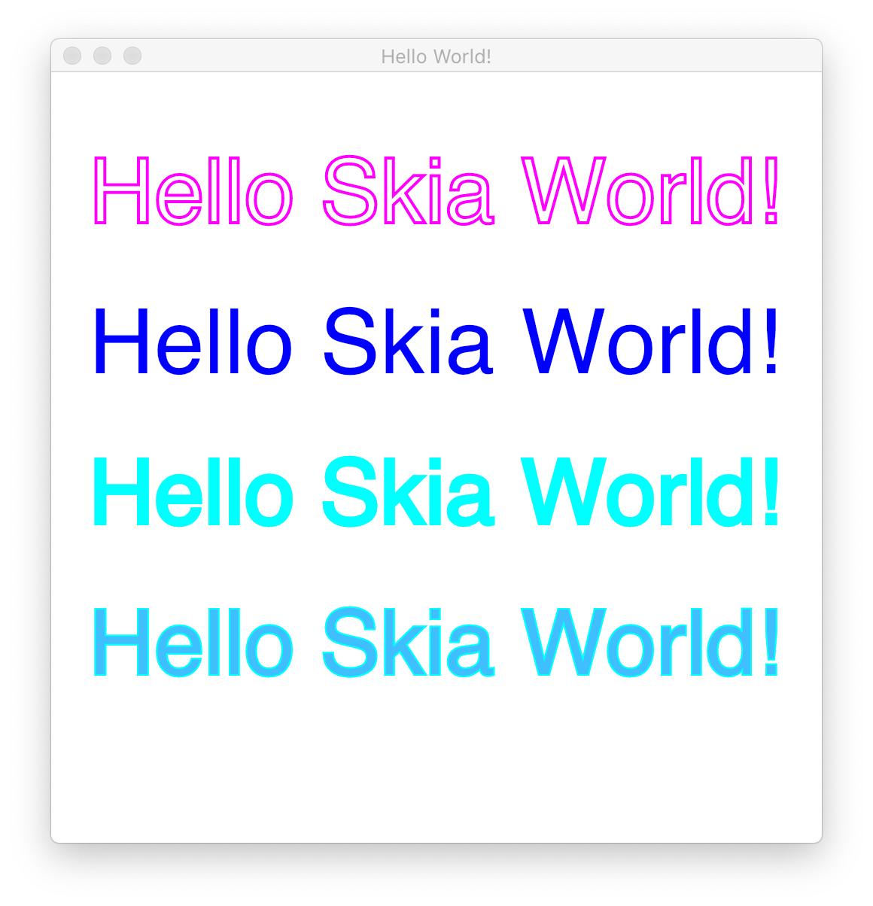
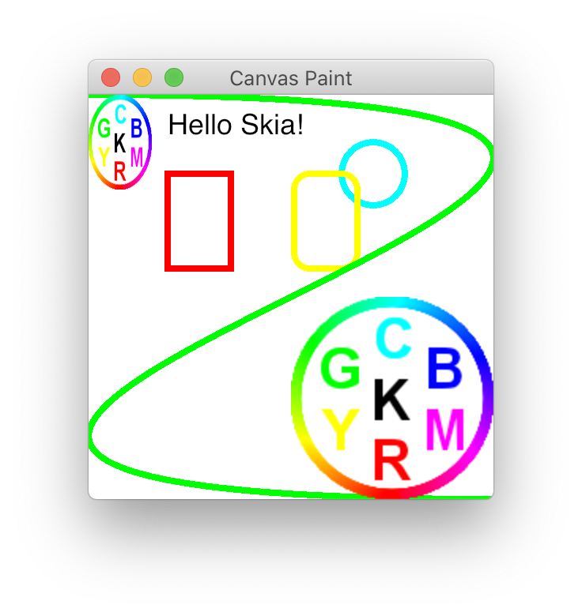

# C bindings for Skia

These have been tailored to the needs of my specific projects and my not be suitable for anyone else.

## Skia version

The Skia version with which these bindings have been tested is from _Wed Nov 10 21:38:56 2021 +0000_
* https://skia.googlesource.com/skia/+/6fae0523629f9abf114d8b7413f71dc7295a13e0
* https://chromium.googlesource.com/chromium/tools/depot_tools.git/+/4d3319e39c9b50747f47da35a351d428a38bcc82

## Noticable changes in Skia code base reflected here

### November 10, 2021

* SkFilterQuality is gone. https://skia.googlesource.com/skia/+/aebe248575affab2137f3d3fb9f94b8e397c4986

## Examples

### Hello World

<kbd></kbd>

### SkCanvas Paint

Copy of this Skia fiddle: https://fiddle.skia.org/c/@skcanvas_paint

<kbd></kbd>

### Rects

<kbd></kbd>
